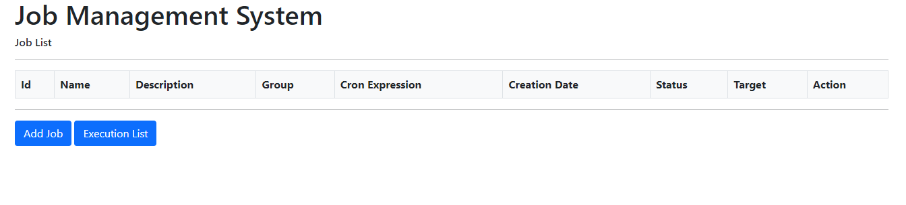
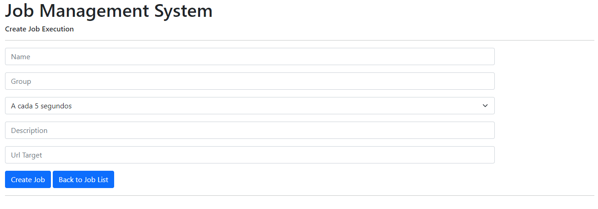
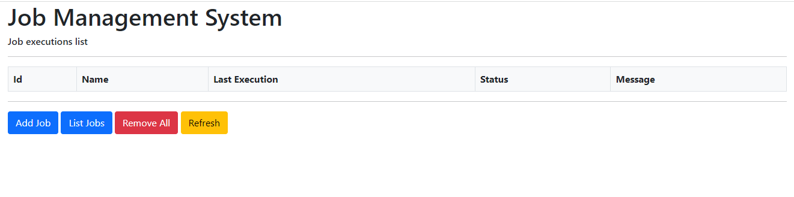

# job-schedule-demo
This application is a very simple example http job schedule using Quartz and Spring boot, with front end based on Thymeleaf.

Access front end using: http://localhost:8080/

Create your jobs using this page

Verify job executions, using this page

